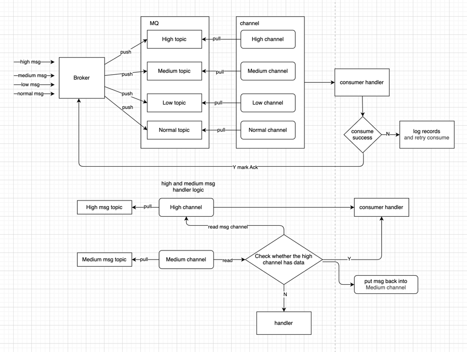

# Priority mq
    优先级队列实现，支持high,medium,low,normal几种类型的优先级队列的任务处理

# Design idea
完整的架构设计如下：

# Current progress
- kafka优先级队列已实现，后续会根据实际情况实现pulsar优先级队列消费。
- 如果每个topic需要不同的consume handler的话，可以根据实际情况调整。
- 每种类型的队列消费支持水平扩容处理以及单独部署，能应对高并发、高性能的业务场景开发。

# Author
    daheige
# How to use
    可以直接看gkafka中的kafka_test.go 创建kafka优先级队列消费
